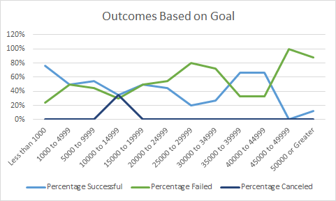

# kickstarter-analysis
##Performing analysis on Kickstarter data to uncover trends

###Overview of Project: 

  The purpose of this analysis was to determine the overall success or lack thereof of different Kickstarter campaigns in reaching their financial goals needed to fund various entertainment projects in different countries. One factor involved in said analysis was whether the month that the theater campaigns were launched played a role in campaign success or failure. The financial goal of different plays were also examined to determine if that affected campaign success.  

###Analysis and Challenges: 

  In order to perform my first analysis of theater outcomes based on launch date, I needed to create a pivot table. I selected all the data in my initial spreadsheet "Kickstarter_Challenge.xlsx". Then I inserted a pivot table onto a spreadsheet that I labelled "Theater Outcomes Based on Launch Date." After this, I filtered my table by category and year, and placed the outcomes as columns in the table. I put the date created conversion in the rows of the pivot table, and then made the values for the table the count of outcomes. I further filtered my pivot table to only include "theater" in the category outcomes of the table. I then grouped the data for the launch date by  month. One challenge I faced was grouping the data by month since the data for launch date was organized by year. I ended up figuring out how to group the data by month using the information found at https://www.pryor.com/blog/grouping-excel-pivottable-data-by-month/ed which showed me how to right click data in the table and select gouping to organize it by month. Once I had my data organized properly in the pivot chart, I was able to create a line graph which depicted the outcomes of my analysis. The linear graph that I built is depicted below
  
                             

  In order to perform my second analysis, which looked at play Kickstarter outcomes based on financial goal, I utilized the CountIfs function in Excel.This was used to filter the data from the "Kickstarter_Challenge.xlsx" sheet into columns depicting the number of successful goals, the number of failed goals, and the number of cancelled goals. Once I had this data, I was able to calculate the percentage of campaigns which were successful, failed, or cancelled. I then highlighted all of this data and created a line chart to depict the outcomes based on the financial goal. The chart that I developed is depicted below
  
                                                      
  
  While doing this analysis, I struggled with filtering the data correctly. I initially looked at the role of successful pledges in outcome success or failure, and then relaized later that I should have filtered by goals values. Once I realized my error, I was able to correct my dataset. 

###Results: 
 
 One conclusion that I can draw about the Theater Outcomes by Launch Date is that the theater campaigns were the most successful in the months of May and June. Another conclusion that I can make is that the theater campaigns were the least successful in the end of the year, in the months of November and December.
  
  I can conclude about the Play Outcomes based on Goals that the most successful campaigns were the ones where the goal was less than 1000 dollars.  
  
 One limitation of this dataset are that there is large variation in campaign numbers based on goals set. For example, 186 projects had a goal of less than 1000 dollars, but as the campaign goals increased financially, the number of campaigns markedly decreased. It is difficult to compare the outcomes of goals on the campaigns when there are vastly less than campaigns with higher financial goals. There is a risk of skewed data. Another more general limitation of the data set is the lack of population information about those who funded the campaigns. The success of a campaign is reliant upon those who choose to fund it, so it would be nice to see which populations by age and gender funded the campaigns, so in the future  when Kickstarter campaigns are run, the fundraiser can target the specific populations which those campaigns appeal to.
 
 Other potential tables that could be created from this data set is a pivot table depicting the comparison of film kickstarter outcomes vs television kickstarter outcomes. This pivot table could then be transformed into a line chart for visual understanding. Another potential table that could be included based on this data set is the relationship between average donation and category of campaign. One could also make a pie chart depicting the difference in average percentage of donations based on category type. 

